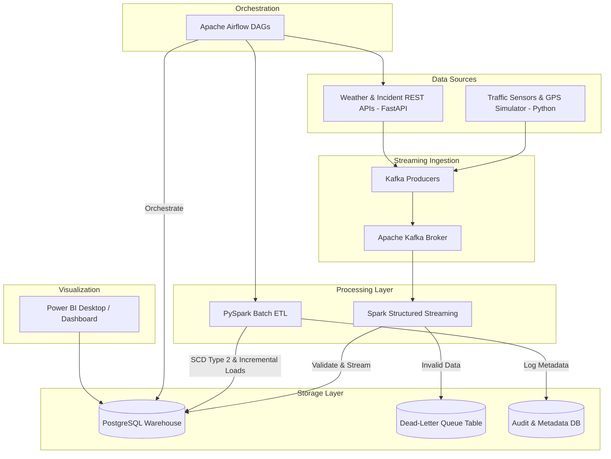

# Smart City Mobility Intelligence Platform

[](https://github.com/yourusername/smart-city-mobility/actions)

A production-grade, end-to-end Smart City Mobility Intelligence Platform designed to ingest, process, and analyze real-time urban traffic data, GPS telemetry, weather conditions, and road incidents. Built with Apache Kafka, Apache Spark (Structured Streaming & PySpark Batch), Apache Airflow, PostgreSQL, FastAPI, and Docker.

---

## Table of Contents
1. [Business Problem & Objectives](#business-problem--objectives)
2. [Architecture Overview](#architecture-overview)
3. [Technology Stack](#technology-stack)
4. [Project Directory Layout](#project-directory-layout)
5. [Database Schema & Data Warehouse Design](#database-schema--data-warehouse-design)
6. [Setup and Deployment Guide](#setup-and-deployment-guide)
7. [Operational Auditing & Dead-Letter Queue (DLQ)](#operational-auditing--dead-letter-queue-dlq)
8. [Power BI Dashboard Setup & KPIs](#power-bi-dashboard-setup--kpis)
9. [CI/CD & Local Testing](#cicd--local-testing)

---

## Business Problem & Objectives
City authorities face significant difficulties monitoring urban congestion patterns, planning transit route timetables, predicting traffic bottlenecks, and allocating emergency services. 

This platform solves this by:
* **Real-Time Data Processing**: Ingesting streams of traffic telemetry and vehicle GPS pings.
* **Batch Ingestion & CDC**: Daily scheduling of public transit timetables and weather station records.
* **SCD Type 2 Dimensional Ingestion**: Handling updates to stationary sensors and vehicle routes over time without losing historical context.
* **Enterprise Reporting**: Providing optimized analytical database views for Power BI visualization.

---

## Architecture Overview
The platform processes data in both real-time streaming and scheduled batch layers (Lambda/Kappa hybrid model):



---

## Technology Stack
* **Python 3.10**: Primary application runtime.
* **Apache Kafka**: Distributed event broker handling real-time ingestion topics.
* **Apache Spark / PySpark**: Stream parsing and large-scale batch processing.
* **Apache Airflow**: Orchestration and scheduling of data ingestion DAGs.
* **PostgreSQL 15**: Relational engine hosting both OLTP (operational data) and OLAP (data warehouse facts/dimensions) schemas.
* **FastAPI**: Lightweight REST services simulating weather reports and incident tickers.
* **Docker & Compose**: Containerized execution and service isolated linking.
* **GitHub Actions**: Automated CI/CD pipeline for code quality, formatting (Black, Flake8), and PySpark unit testing.

---

## Project Directory Layout
```text
smart-city-mobility/
├── .github/
│   └── workflows/
│       └── ci-cd.yml          # GitHub Actions workflow for linting, testing, and Docker builds
├── airflow/
│   └── dags/
│       ├── transit_schedule_dag.py # Ingests public transport schedule batch files
│       └── weather_incidents_dag.py # Incremental batch loads for weather & incidents
├── docker/
│   ├── docker-compose.yml     # Complete local stack (Kafka, Spark, Airflow, Postgres, FastAPI)
│   ├── airflow.Dockerfile
│   ├── spark.Dockerfile
│   └── fastapi.Dockerfile
├── fastapi_app/
│   ├── main.py                # FastAPI endpoints for incident reporting and weather
│   └── requirements.txt
├── kafka/
│   ├── producers/
│   │   ├── traffic_producer.py # Streams traffic sensor & GPS vehicle data
│   │   └── producer_config.py
│   ├── consumers/
│   │   └── dlq_logger.py       # Simple consumer to monitor dead-letter topics
│   └── requirements.txt
├── spark/
│   ├── jobs/
│   │   ├── stream_traffic_metrics.py # Spark Streaming from Kafka to Postgres
│   │   └── batch_historical_etl.py   # PySpark Batch processing & SCD Type 2
│   └── requirements.txt
├── sql/
│   ├── create_databases.sql   # Creates Airflow metadata database
│   ├── init_oltp.sql          # Operational schema (sensors, schedules)
│   ├── init_dw.sql            # Warehouse schema (facts, dims, audit, SCD Type 2, DLQ)
│   └── powerbi_views.sql      # Database views optimized for Power BI KPIs
├── tests/
│   ├── test_validation.py     # Schema validation and DLQ logic tests
│   └── test_spark_jobs.py     # PySpark job business logic unit tests
└── README.md                  # Detailed platform manual
```

---

## Database Schema & Data Warehouse Design
PostgreSQL functions as the consolidated database containing two primary schemas:
1. **`oltp` Schema (Operational)**:
   * `sensors`: Telemetry station registry.
   * `transit_routes`: Transport routing metadata.
   * `vehicles`: Fleet registry assigned to active routes.
   * `weather_stations`: Climatology coordinates.
2. **`dw` Schema (Star Schema Data Warehouse)**:
   * Dimensions: `dim_date`, `dim_time`, `dim_sensors` (SCD Type 2), `dim_vehicles` (SCD Type 2), `dim_weather_stations` (SCD Type 1).
   * Facts: `fact_traffic_readings`, `fact_gps_pings`, `fact_weather_readings`, `fact_incident_reports`.
   * Auditing/Governance: `etl_audit_log` (execution run registry), `dead_letter_queue` (corrupted payloads).

---

## Setup and Deployment Guide

### Prerequisites
* [Docker Desktop](https://www.docker.com/products/docker-desktop/) (configured to allocate at least 4GB RAM).
* [Git](https://git-scm.com/).

### Deployment Steps
1. **Clone the repository**:
   ```bash
   git clone https://github.com/yourusername/smart-city-mobility.git
   cd smart-city-mobility
   ```

2. **Boot the platform stack**:
   Inside the root folder, navigate to the docker folder and spin up the environment:
   ```bash
   cd docker
   docker-compose up -d --build
   ```
   *This downloads base images, builds custom nodes (Spark, Airflow, FastAPI), registers networks, and starts all systems.*

3. **Verify running containers**:
   ```bash
   docker ps
   ```
   You should see: `postgres-db`, `zookeeper`, `kafka`, `kafka-setup`, `fastapi-app`, `spark-master`, `spark-worker`, `spark-stream-job`, `traffic-producer`, `dlq-logger`, `airflow-webserver`, and `airflow-scheduler`.

4. **Access Web Interfaces**:
   * **Apache Airflow Console**: [http://localhost:8085](http://localhost:8085) (Credentials: `admin` / `admin`)
   * **Spark Master UI**: [http://localhost:8090](http://localhost:8090)
   * **FastAPI Docs (Swagger)**: [http://localhost:8000/docs](http://localhost:8000/docs)

---

## Operational Auditing & Dead-Letter Queue (DLQ)
This project enforces strict data governance, making it ready for high-compliance production workloads.

### Data Validation
Spark Structured Streaming validates incoming Kafka records. Payload errors (e.g. negative speeds, out-of-bounds coordinates, or malformed JSON payloads) are redirected:
* Written directly to `dw.dead_letter_queue` table in Postgres for auditing.
* Dispatched to Kafka's `dead-letter-topic` for real-time alerting.

To verify invalid messages in the DLQ:
```sql
SELECT * FROM dw.dead_letter_queue ORDER BY created_at DESC;
```

### ETL Run Auditing
Every Airflow execution and Spark batch SCD Type 2 job logs details into `dw.etl_audit_log`:
```sql
SELECT * FROM dw.etl_audit_log ORDER BY start_time DESC;
```

---

## Power BI Dashboard Setup & KPIs
The database pre-compiles analytics views under the `dw` schema to facilitate drag-and-drop KPI building in Power BI.

### Setup Instructions
1. Open **Power BI Desktop**.
2. Select **Get Data** -> **PostgreSQL Database**.
3. Set server as `localhost:5432` and database name as `mobility_dw`. Set data connectivity mode to **Import** or **DirectQuery**.
4. Input database credentials: Username: `postgres`, Password: `postgres`.
5. Select and import the following views:
   * `dw.v_congestion_analysis`
   * `dw.v_travel_time_trends`
   * `dw.v_incident_hotspots`
   * `dw.v_bus_punctuality`
   * `dw.v_peak_hour_analysis`

### KPI Layout Mapping
* **Congestion Index**: Bind `congestion_index` from `dw.v_congestion_analysis` to a gauge visual, categorized by `location_name` and sliced by `congestion_level`.
* **Average Travel Time**: Card visual aggregating `avg_speed_mph` and `estimated_minutes_per_mile` from `dw.v_travel_time_trends`.
* **Accident Hotspots**: Map visual mapping `latitude` and `longitude` from `dw.v_incident_hotspots` with bubble size bound to `hazard_score`.
* **Bus Punctuality**: Pie/donut visual using `punctuality_status` from `dw.v_bus_punctuality` sliced by `assigned_route_id`.
* **Peak-Hour Analysis**: Column chart showing `avg_congestion_index` and `avg_volume` across `time_period` values from `dw.v_peak_hour_analysis`.

---

## CI/CD & Local Testing
The codebase uses `pytest` for validation and PySpark logic testing.

### Running Local Tests
1. Install development requirements:
   ```bash
   pip install -r requirements-dev.txt
   ```
2. Execute the test suite:
   ```bash
   pytest tests/
   ```

The automated GitHub Actions workflow will execute these tests and run syntax checks automatically on every code push.
